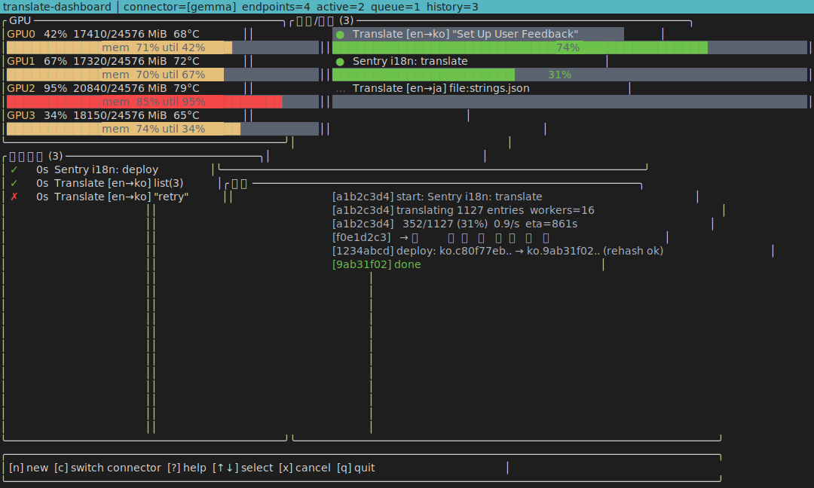
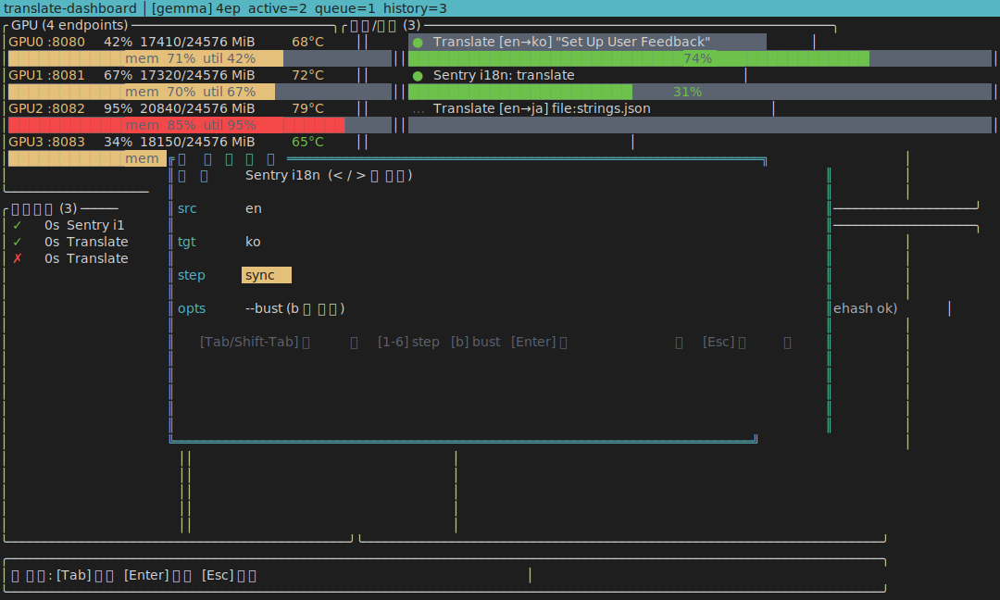

# translate-dashboard

Ratatui 기반 **GPU 번역 인프라 대시보드** — 여러 TranslateGemma 인스턴스 상태 + 다중 번역 작업 큐 + 실시간 로그를 한 화면에 표시하는 Rust TUI.

[gemma-translate](https://github.com/dalsoop/gemma-translate) 서버와 함께 씁니다.

## 스크린샷

### 메인 화면 (GPU · 작업 큐 · 히스토리 · 로그)



### 새 작업 추가 모달



스크린샷은 `cargo run --release --bin screenshot -- main|newjob` 로 재생성 가능합니다.

## 기능

- **GPU 패널** — 4개 인스턴스 VRAM/util/온도 실시간 (SSH + nvidia-smi 폴링)
- **작업 큐** — 여러 번역 작업을 동시에 enqueue, 라운드로빈으로 분산
- **히스토리** — 완료된 작업 + 소요 시간
- **로그** — stdout/stderr 스트리밍
- **New Job 모달** — Translate / Sentry i18n 파이프라인 폼
- **Nickel config** — 엔드포인트/GPU/기본값 전부 파일 하나로 정의

## 빌드

```bash
cargo build --release
```

## 실행

`config.ncl` 편집 후:

```bash
./target/release/translate-dashboard config.ncl
```

Nickel CLI 없으면 → `config.ncl.json` 이나 `config.json` 파일을 옆에 두세요 (구조 동일).

## 키 바인딩

| 키 | 동작 |
|----|------|
| `n` | 새 작업 추가 |
| `Tab` | 포커스 순환 |
| `q` / `Ctrl-C` | 종료 |

### New Job 모달 안에서

| 키 | 동작 |
|----|------|
| `Tab` | 필드 이동 |
| `< / >` 또는 `←→` | Translate ↔ Sentry 전환 |
| `1-6` (Sentry일 때) | extract/scan/translate/build/deploy/sync |
| `b` (Sentry일 때) | `--bust` 토글 |
| `Enter` | 큐에 추가 |
| `Esc` | 취소 |

## 구조

```
translate-dashboard/
├── config.ncl                  기본 설정
├── src/
│   ├── main.rs                 엔트리 + event loop
│   ├── app.rs                  App 상태 + 폼
│   ├── config.rs               Nickel → JSON 파싱
│   ├── ui/                     Ratatui 레이아웃 + 패널
│   ├── backend/
│   │   ├── gpu.rs              ssh nvidia-smi 폴러
│   │   ├── translate.rs        TranslateGemma HTTP 클라이언트
│   │   └── worker.rs           작업 실행자
│   └── jobs/
│       ├── mod.rs              Job/JobStatus/JobKind
│       ├── translate.rs        범용 번역 job
│       └── sentry.rs           Sentry i18n job
```

## 의존성

- **런타임**: ssh 접근 가능한 GPU 호스트, `phs-translate` + `phs-sentry-i18n` CLI 설치
- **Nickel** (선택): `cargo install nickel-lang-cli` — 없으면 `config.json` 사용

## 라이선스

MIT
